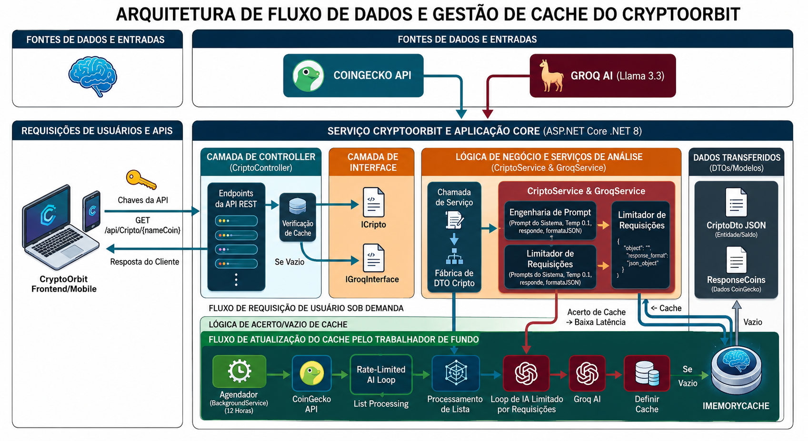

# 🚀 CryptoOrbit

> **Microsserviço de Análise de Criptoativos com IA em Tempo Real**


O **CryptoOrbit** é um microsserviço inteligente desenvolvido em **ASP.NET Core Web API (.NET 8.0)** que realiza análises financeiras interpretativas de criptoativos em tempo real. Ele vai além das cotações tradicionais ao fundir métricas instantâneas de mercado da **CoinGecko** com relatórios analíticos gerados sob demanda por Inteligência Artificial (**Groq Llama-3.3-70b**).


<p align="center">
  
</p>


## 🎯 Visão Geral

### Diferenciais Estratégicos

| Recurso | Descrição |
|---|---|
| 🤖 **Fusão de Cotações com IA** | Automatiza a interpretação de flutuações complexas de preços para o usuário final |
| 📊 **Micro-Decisões de Sentimento** | Classifica instantaneamente o cenário do ativo: Alta, Correção ou Lateralização |
| ⚡ **Mitigação de Latência** | Cache em memória sob demanda garante respostas rápidas para moedas consultadas repetidamente |

---

## 🏗 Arquitetura

A API adota práticas de **Clean Architecture** com forte desacoplamento via injeção de dependência por interfaces bem definidas.

```
[ Cliente / Requisição HTTP ]
│
├──► [ CriptoController ] ◄──► IMemoryCache (Sob demanda, expiração de 10 min)
│         │
│         ├─► (Cache HIT) ──► Retorna JSON em milissegundos
│         │
│         └─► (Cache MISS / Expirado)
│               │
│               ▼
│          [ ICripto / CriptoServices ]
│               │
│               ├─► CoinGecko API  (Preço, Volume, Variação 24h)
│               │
│               └─► IGroqInterface / GroqServices
│                     │
│                     ▼  (Temp: 0.1 | JSON Mode)
│                [ Groq AI Llama-3.3 ]
```

---

## 📁 Estrutura do Projeto

```
📁 CryptoOrbit/
│
├── 📁 Configurations/
│   └── ExternalServicesOptions.cs       # Mapeamento de opções de serviços externos
│
├── 📁 Controller/
│   └── CriptoController.cs              # Endpoints RESTful com suporte a cache sob demanda
│
├── 📁 Dtos/
│   └── CriptoDto.cs                     # Higienização e transporte seguro de payloads
│
├── 📁 Interfaces/
│   ├── ICripto.cs                       # Contrato do serviço de criptoativos
│   └── IGroqInterface.cs                # Abstração para testes e mocks da IA
│
├── 📁 Models/
│   └── ResponseCoins.cs                 # Modelos de binding de respostas externas
│
└── 📁 Services/
    ├── CriptoServices.cs                # Orquestração de dados e montagem de prompts
    └── GroqServices.cs                  # Comunicação HTTP segura com a API do Groq
```

---

## ⚙️ Recursos de Engenharia e Performance

### 🛡️ Throttling Control (Prevenção de Rate Limits)
Para a listagem em lote (`GetAllCoinsWithAnalysisAsync`), o serviço introduz uma janela controlada de **7 segundos** entre chamadas sequenciais ao LLM, blindando a aplicação contra bloqueios HTTP 429 na API da Groq.

### 🎯 Determinismo na Resposta da IA
O modo JSON nativo do modelo é forçado via `response_format = { type: "json_object" }` com temperatura calibrada em **0.1**, eliminando alucinações e garantindo conversão perfeita para o `CriptoDto`.

### ⚡ Cache Sob Demanda
O `CriptoController` utiliza o `IMemoryCache` diretamente no endpoint `GetInfoCoin` com expiração absoluta de **10 minutos**. Isso reduz drasticamente o tempo de resposta (de segundos para milissegundos) para consultas consecutivas da mesma criptomoeda, além de otimizar o uso das APIs externas e de IA.

---

## 🔗 API Reference

**Base URL:** `/api/Cripto`

### 🔐 Parâmetros e Headers por Endpoint

---

### `GET /api/Cripto/get-all-coins`

Retorna um array com a lista das **20 principais criptomoedas** do mercado mundial diretamente da CoinGecko, sem enriquecimento da IA Groq (garantindo carregamento instantâneo).

* **Header Obrigatório:**
  * `x-cg-demo-api-key` (string): Chave de autenticação da CoinGecko.

**Resposta:** `HTTP 200 OK` — Array de `CriptoDto` (com recomendação nula/vazia).

---

### `GET /api/Cripto/{nameCoin}`

Retorna a análise detalhada, com cálculo de oscilação e o relatório de recomendação estruturado pela IA Groq Llama 3.3.

* **Headers Obrigatórios:**
  * `x-cg-demo-api-key` (string): Chave de autenticação da CoinGecko.
  * `X-Groq-Key` (string): Token de acesso à API da Groq AI.

* **Parâmetros de Rota:**
  * `nameCoin` (string): Nome ou símbolo do ativo (ex: `bitcoin`, `solana`, `eth`).

**Exemplo de Resposta (`HTTP 200 OK`):**

```json
{
  "name": "Bitcoin",
  "symbol": "btc",
  "image": "https://assets.coingecko.com/coins/images/1/large/bitcoin.png",
  "current_price": 68450.00,
  "high_24h": 69200.00,
  "low_24h": 67800.00,
  "price_change_percentage_24h": 1.72,
  "price_range": 1400.00,
  "total_volume": 28495028450,
  "recommendation": "O ativo Bitcoin (btc) apresenta um cenario de tendencia de alta nas ultimas 24 horas, acumulando uma variacao de 1.72%. Com o preco atual cotado em 68450, o ativo registrou uma oscilacao diaria entre a minima de 67800 e a maxima de 69200, movimentando um volume total de 28495028450 no mercado."
}
```

---

## 🔌 Guia de Integração

### JavaScript / TypeScript (React, Vue, Vanilla)

```javascript
const fetchCoinAnalysis = async (coinName) => {
  const url = `https://seu-dominio.com/api/Cripto/${coinName}`;

  try {
    const response = await fetch(url, {
      method: 'GET',
      headers: {
        'Accept': 'application/json',
        'x-cg-demo-api-key': 'SUA_CHAVE_COINGECKO_AQUI',
        'X-Groq-Key': 'SUA_CHAVE_GROQ_AQUI'
      }
    });

    if (!response.ok) throw new Error(`Erro na API: ${response.status}`);

    const data = await response.json();
    console.log("Dados do Ativo Enriquecidos:", data);
    return data;
  } catch (error) {
    console.error("Falha ao buscar dados:", error);
  }
};
```

### Python (Scripts de Trading / Data Science)

```python
import requests

def get_crypto_analysis(coin_name: str, cg_key: str, groq_key: str):
    url = f"https://seu-dominio.com/api/Cripto/{coin_name}"
    headers = {
        "x-cg-demo-api-key": cg_key,
        "X-Groq-Key": groq_key,
        "Accept": "application/json"
    }

    try:
        response = requests.get(url, headers=headers)
        response.raise_for_status()
        data = response.json()
        print(f"Recomendação para {data['name']}: {data['recommendation']}")
        return data
    except requests.exceptions.HTTPError as err:
        print(f"Erro na requisição: {err}")
```

### C# (.NET HttpClient)

```csharp
using System.Net.Http.Headers;
using System.Text.Json;

public class CryptoClient
{
    private readonly HttpClient _httpClient;

    public CryptoClient(HttpClient httpClient) => _httpClient = httpClient;

    public async Task<CriptoDto> FetchAnalysisAsync(string coinName, string cgKey, string groqKey)
    {
        var request = new HttpRequestMessage(HttpMethod.Get, $"api/Cripto/{coinName}");
        request.Headers.Add("x-cg-demo-api-key", cgKey);
        request.Headers.Add("X-Groq-Key", groqKey);

        var response = await _httpClient.SendAsync(request);
        response.EnsureSuccessStatusCode();

        var content = await response.Content.ReadAsStringAsync();
        return JsonSerializer.Deserialize<CriptoDto>(content, new JsonSerializerOptions
        {
            PropertyNameCaseInsensitive = true
        });
    }
}
```

---

## 🚀 Como Executar

**Pré-requisitos:** .NET 8.0 SDK, chave CoinGecko e chave Groq AI.

```bash
# 1. Clone o repositório
git clone https://github.com/seu-usuario/CryptoOrbit.git
cd CryptoOrbit

# 2. Configure as variáveis no appsettings.json ou via ambiente
# CoinGeckoApiKey, GroqApiKey e lista das top 20 moedas

# 3. Restaure as dependências e execute
dotnet restore
dotnet run
```

A API estará disponível em `https://localhost:5001/api/Cripto`.


---

<p align="center">Feito com ☕ e .NET</p>
