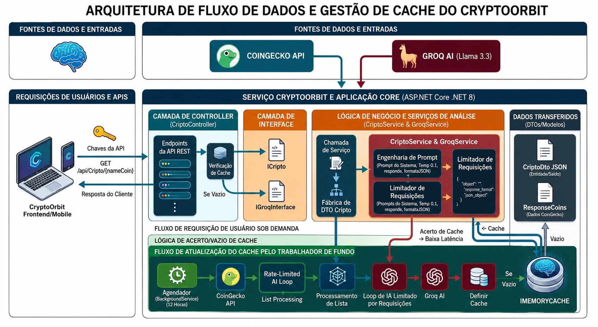

# 🚀 CryptoOrbit

> **Microsserviço de Análise de Criptoativos com IA em Tempo Real**


O **CryptoOrbit** é um microsserviço inteligente desenvolvido em **ASP.NET Core Web API (.NET 10.0)** que realiza análises financeiras interpretativas de criptoativos em tempo real. Ele vai além das cotações tradicionais ao fundir métricas instantâneas de mercado da **CoinGecko** com relatórios analíticos gerados sob demanda por Inteligência Artificial via roteador de LLMs (**9router** com suporte a Claude, Nemotron, Llama e modelos customizados).

<p align="center">
  
</p>

## 🎯 Visão Geral

### Diferenciais Estratégicos

| Recurso | Descrição |
|---|---|
| 🤖 **Fusão de Cotações com IA** | Automatiza a interpretação de flutuações de mercado e sentimentos para o usuário final |
| 📊 **Micro-Decisões Estruturadas** | Classifica o cenário do ativo (Alta, Correção ou Lateralização) e sugere estratégias de aporte |
| ⚡ **Mitigação de Latência** | Cache em memória sob demanda garante respostas em milissegundos para consultas repetidas |
| 🔄 **Roteamento Flexível de LLMs** | Suporte dinâmico a múltiplos modelos e provedores de IA via 9router, com fallback configurável |

---

## 🏗 Arquitetura

A API adota práticas de arquitetura limpa com forte desacoplamento via injeção de dependência por interfaces.

```
[ Cliente / Requisição HTTP ]
│
├──► [ CriptoController ] ◄──► IMemoryCache (Sob demanda, expiração de 10 min)
│         │
│         ├─► (Cache HIT) ──► Retorna JSON em milissegundos
│         │
│         └─► (Cache MISS / Expirado)
│               │
│               ▼
│          [ ICripto / CriptoService ]
│               │
│               ├─► CoinGecko API (Preço, Volume, Variação 24h, Máx/Mín)
│               │
│               └─► IAiService / NineRouterService (ou fallback IGroqInterfece)
│                     │
│                     ▼  (Temp, Model e Throttling via appsettings)
│                [ 9router / LLM ] (devQuest, Claude, Nemotron, Llama)
```

---

## 📁 Estrutura do Projeto

```
📁 CryptoOrbit/
│
├── 📁 Configurations/
│   └── ExternalServicesOptions.cs       # Mapeamento Options Pattern (CoinGecko, NineRouter, Cache)
│
├── 📁 Controller/
│   └── CriptoController.cs              # Endpoints RESTful com suporte a cache sob demanda
│
├── 📁 Dtos/
│   └── CriptoDto.cs                     # Transporte estruturado de dados e recomendações
│
├── 📁 Interfaces/
│   ├── ICripto.cs                       # Contrato do serviço de criptoativos
│   ├── IAiService.cs                    # Abstração principal para integração com provedores de IA
│   └── IGroqInterface.cs                # Interface de compatibilidade com clientes legados de IA
│
├── 📁 Models/
│   └── ResponseCoins.cs                 # Modelos de binding de respostas externas
│
└── 📁 Services/
    ├── CriptoServices.cs                # Orquestração de dados, cálculo financeiro e montagem de prompts
    ├── NineRouterService.cs             # Integração com 9router, sanitização de SSE e parsing de JSON
    └── GroqServices.cs                  # Cliente legado para comunicação direta com a API Groq
```

---

## ⚙️ Recursos de Engenharia e Performance

### 🛡️ Throttling Control Configurável
No processamento sequencial de moedas (`GetAllCoinsWithAnalysisAsync`), o intervalo entre chamadas à IA é configurável via `ThrottlingDelaySeconds` no `appsettings.json`, prevenindo bloqueios de *rate limit* (HTTP 429) no provedor.

### 🧩 Resiliência Universal para Modelos de IA
- **Compatibilidade com Modelos Open-Source:** O prompt instrui o modelo a retornar JSON estrito sem depender do recurso `response_format = { type: "json_object" }` (que causa erro HTTP 400 em diversos modelos menores).
- **Extração Delimitada:** O serviço localiza dinamicamente os delimitadores `{` e `}` no texto gerado, ignorando marcações em markdown (` ```json `) ou preâmbulos de raciocínio (*reasoning*).
- **Sanitização de Streaming SSE:** Remove automaticamente sufixos de Server-Sent Events como `data: [DONE]`, evitando falhas no parser de JSON.

### ⚡ Cache Sob Demanda
O `CriptoController` utiliza `IMemoryCache` diretamente no endpoint com expiração absoluta de **10 minutos**, reduzindo custos de API e conferindo respostas instantâneas a requisições consecutivas da mesma moeda.

### ⚙️ Centralização por Options Pattern
Todos os parâmetros essenciais (`Model`, `Temperature`, `BaseUrl`, `ApiKey`, `DefaultCurrency`, etc.) são injetados via `IOptions<ExternalServicesOptions>`, permitindo ajustes em tempo de execução sem alterar código-fonte.

---

## 🔗 API Reference

**Base URL:** `/api/Cripto`

### Endpoints

---

### `GET /api/Cripto/get-all-coins`

Retorna a listagem das principais criptomoedas do mercado diretamente da CoinGecko (sem enriquecimento da IA, garantindo carregamento ultrarrápido).

* **Header Obrigatório:**
  * `x-cg-demo-api-key` (string): Chave de autenticação da CoinGecko Demo API.

**Resposta:** `HTTP 200 OK` — Lista de `CriptoDto`.

---

### `GET /api/Cripto/{nameCoin}`

Retorna as métricas completas de mercado da moeda informada somadas à recomendação e análise quantitativa estruturada gerada pela IA.

* **Parâmetros de Rota:**
  * `nameCoin` (string): Nome ou símbolo do ativo (ex: `bitcoin`, `ethereum`, `solana`).

* **Headers Obrigatórios:**
  * `x-cg-demo-api-key` (string): Chave de autenticação da CoinGecko.
  * `X-Groq-Key` (string): Chave de API da IA (pode ser o Bearer Token do seu 9router ou da Groq).

**Exemplo de Resposta (`HTTP 200 OK`):**

```json
{
  "name": "Bitcoin",
  "symbol": "btc",
  "image": "https://coin-images.coingecko.com/coins/images/1/large/bitcoin.png",
  "current_price": 84065,
  "high_24h": 85208,
  "low_24h": 83230,
  "price_change_percentage_24h": -0.38658,
  "price_range": 1978,
  "total_volume": 35979870969,
  "recommendation": "O ativo Bitcoin (btc) apresenta um cenário de lateralizacao nas últimas 24 horas, acumulando uma variação de -0,38%. Com o preço atual cotado em 84065, o ativo registrou uma oscilação diária entre a mínima de 83230 e a máxima de 85208, movimentando um volume total de 35979870969 no mercado. No momento, nossa IA recomenda AGUARDAR..."
}
```

---

## 🔌 Guia de Integração

### JavaScript / TypeScript (Fetch API)

```javascript
const fetchCoinAnalysis = async (coinName) => {
  const url = `http://localhost:5073/api/Cripto/${coinName}`;

  try {
    const response = await fetch(url, {
      method: 'GET',
      headers: {
        'Accept': 'application/json',
        'x-cg-demo-api-key': 'SUA_CHAVE_COINGECKO',
        'X-Groq-Key': 'SUA_CHAVE_9ROUTER_OU_IA'
      }
    });

    if (!response.ok) throw new Error(`Erro na API: ${response.status}`);

    const data = await response.json();
    console.log("Análise Enriquecida:", data);
    return data;
  } catch (error) {
    console.error("Falha ao buscar dados:", error);
  }
};
```

### Python (Requests)

```python
import requests

def get_crypto_analysis(coin_name: str, cg_key: str, ai_key: str):
    url = f"http://localhost:5073/api/Cripto/{coin_name}"
    headers = {
        "x-cg-demo-api-key": cg_key,
        "X-Groq-Key": ai_key,
        "Accept": "application/json"
    }

    response = requests.get(url, headers=headers)
    response.raise_for_status()
    data = response.json()
    print(f"Recomendação para {data['name']}: {data['recommendation']}")
    return data
```

### C# (HttpClient)

```csharp
using System.Net.Http.Json;
using CryptoOrbit.Dtos;

public class CryptoClient
{
    private readonly HttpClient _httpClient;

    public CryptoClient(HttpClient httpClient) => _httpClient = httpClient;

    public async Task<CriptoDto?> FetchAnalysisAsync(string coinName, string cgKey, string aiKey)
    {
        using var request = new HttpRequestMessage(HttpMethod.Get, $"api/Cripto/{coinName}");
        request.Headers.Add("x-cg-demo-api-key", cgKey);
        request.Headers.Add("X-Groq-Key", aiKey);

        using var response = await _httpClient.SendAsync(request);
        response.EnsureSuccessStatusCode();

        return await response.Content.ReadFromJsonAsync<CriptoDto>();
    }
}
```

---

## 🚀 Como Executar

### Pré-requisitos
* [.NET 10.0 SDK](https://dotnet.microsoft.com/download) instalado.
* Chave da [CoinGecko Demo API](https://www.coingecko.com/en/api).
* Endpoint e chave de acesso ao **9router** (ou provedor OpenAI-compatible).

### Passo a Passo

```bash
# 1. Clone o repositório
git clone https://github.com/seu-usuario/CryptoOrbit.git
cd CryptoOrbit

# 2. Configure os parâmetros no appsettings.Development.json
# (BaseUrl, ApiKey, Model do NineRouter e CoinGecko)

# 3. Restaure e execute o microsserviço
dotnet restore
dotnet run
```

A API estará disponível por padrão em:
* **HTTP:** `http://localhost:5073`
* **HTTPS:** `https://localhost:7034`
* **Swagger UI:** `http://localhost:5073/swagger`

---

<p align="center">Feito com ☕, .NET 10 e IA</p>

